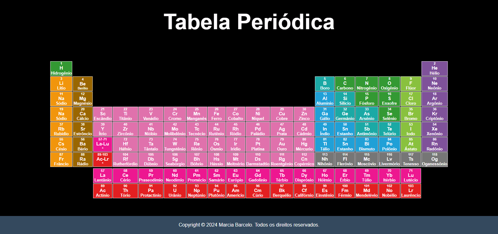

# Tabela Periódica

Este é um projeto de tabela periódica desenvolvido utilizando HTML e CSS como atividade do curso <Descodificadas/> trilha 02. A tabela periódica é uma ferramenta importante para a compreensão da estrutura dos elementos químicos e de suas propriedades.

## Funcionalidades

- Exibe os elementos químicos em uma tabela organizada.

## Como Usar

Basta abrir o arquivo `index.html` em qualquer navegador da web para visualizar a tabela periódica.

## Contribuindo

Contribuições são bem-vindas! Sinta-se à vontade para enviar pull requests com melhorias ou correções.

## Autor

- **Marcia Barcelo** - [GitHub](https://github.com/Mpbarcelo)

## Licença

Este projeto está licenciado sob a Licença MIT - veja o arquivo [LICENSE](LICENSE) para mais detalhes.
